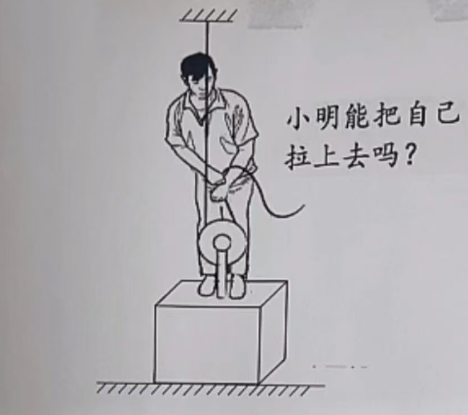
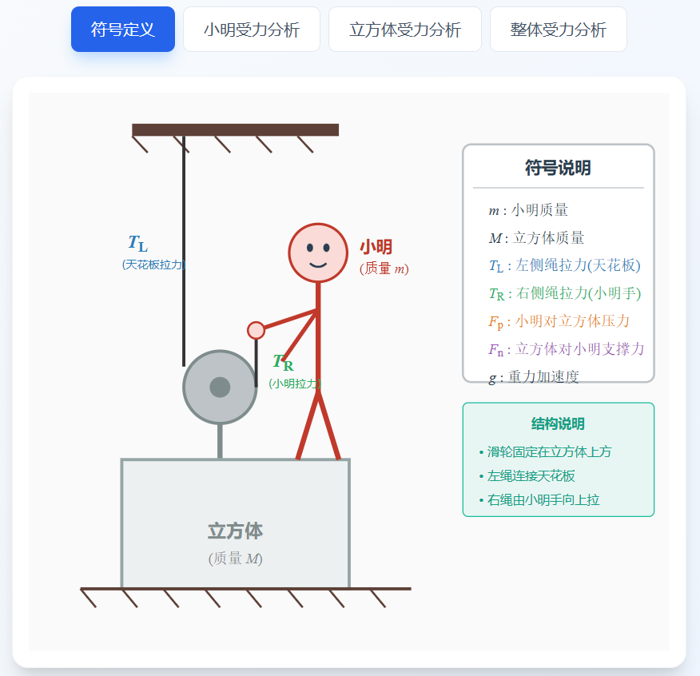
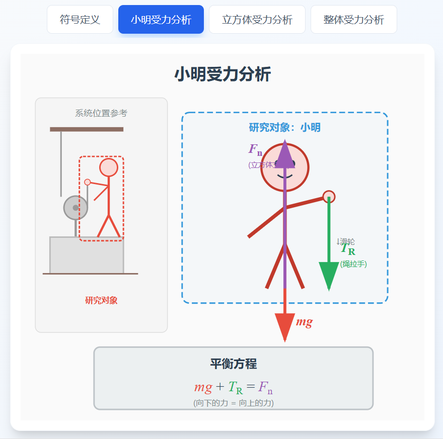
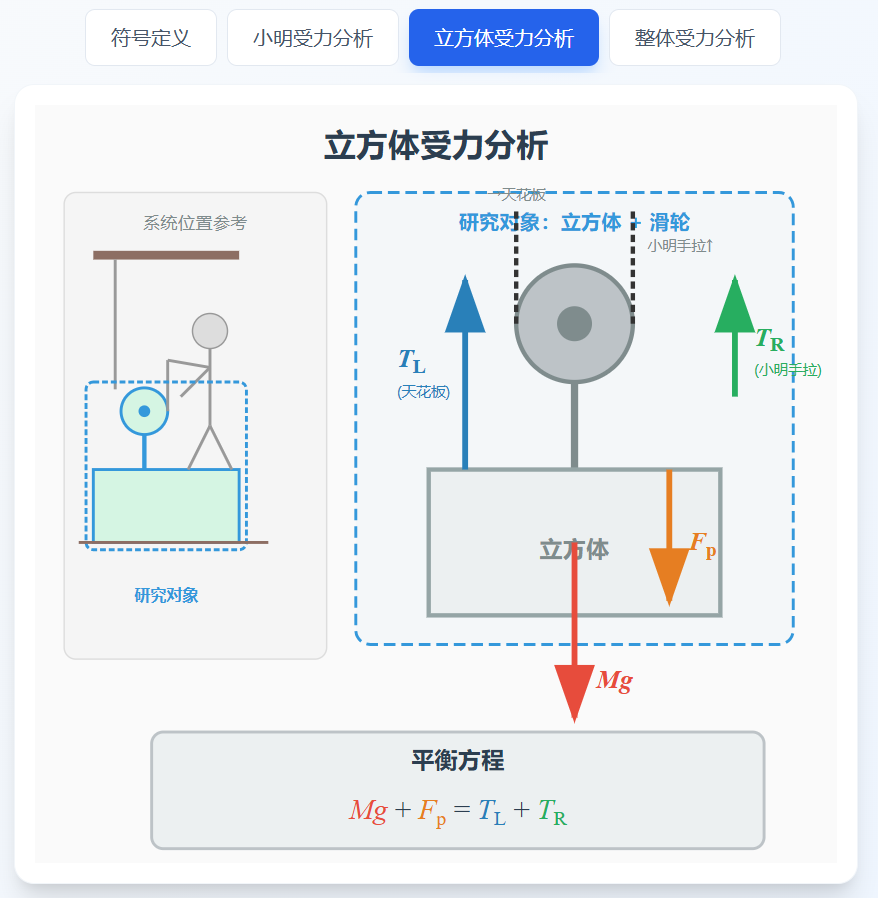
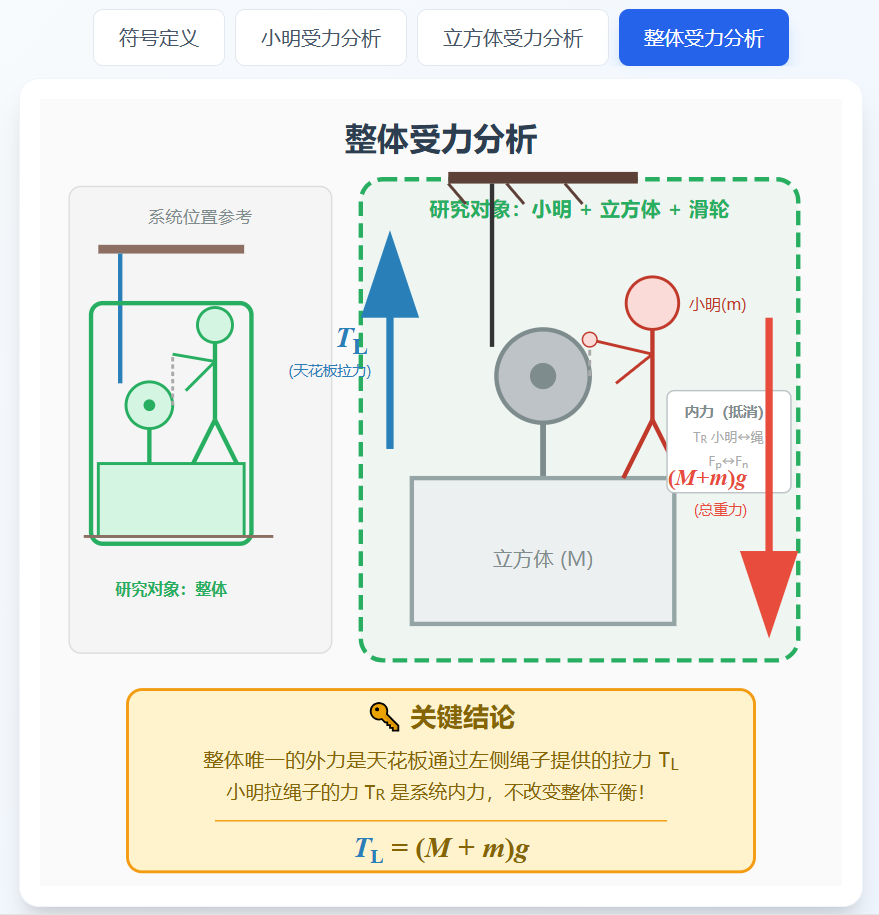
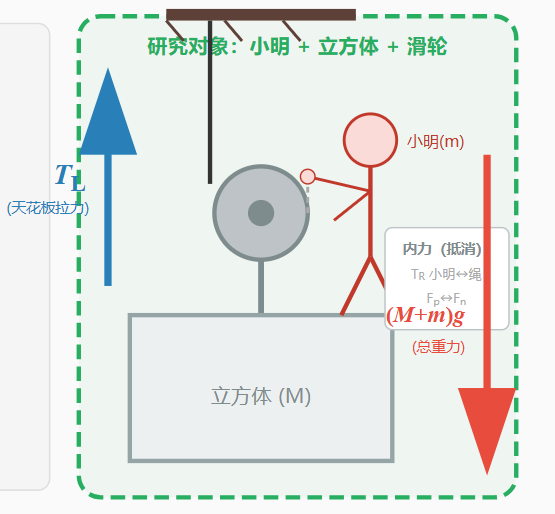

## 问题描述

小明站在一个立方体上，整个滑轮装置连接在立方体上方，绳子穿过滑轮，滑轮左侧绳子固定在天花板，右侧绳子由小明手持。



**核心问题：小明能否通过拉绳子把自己和立方体一起向上提升？**

---

## 0、初步分析

先说结论，**只要小明能使出大于【自己+立方体】重量的力，小明就可以把自己拉起来！**

- 当小明的手完全不发力，地面对立方体的支持力 F 等于小明和立方体的总重力 G （F=G）。此时，滑轮左侧一端的天花板和右侧一端的手都不提供任何拉力
- 当小明开始手握绳子向上拉，天花板一端绳子明显绷紧，此时左侧天花板提供了一点向上的拉力 T，此时 F + T = G。
- 当小明拉力加大，T 逐渐加大，达到 G 时，地面的支持力 F 减小到 0, 此时立方体和地面只是接触，但是以及 “悬浮” 起来了，此时 T=G
- 当向上的拉力继续变大，变成 T > G，那么整体合力向上，于是有了向上移动的加速度，小明也就把自己和立方体一起抬起来了

**是不是觉得很有些反直觉？没关系，看完以下的分析，定能让你 “拨云见日，茅塞顿开” ！**

## 一、静态平衡分析

为了更好地分析这个过程，我们先进行一下立方体刚刚 “悬浮” 起来那一刻，**系统局部**，和 **系统整体** 的受力分析

### 符号定义



- 小明质量：m
- 立方体质量：M
- 左侧绳子拉力（天花板提供）：TL
- 右侧绳子拉力（小明手拉）：TR
- 小明对立方体的压力：Fp
- 立方体对小明的支撑力：Fn
- 重力加速度：g

### 1. 对小明的受力分析



**向下的力：**
- 重力：mg
- 绳子向下拉力：TR（拉力是相互的）

**向上的力：**
- 立方体对小明的支撑力：Fn

**平衡方程：**
``` 
[式子1] mg + TR = Fn
```

### 2. 对立方体的受力分析



**向下的力：**
- 立方体重力：Mg
- 小明的压力：Fp（根据牛顿第三定律，Fp = Fn）

**向上的力：**
- 滑轮两侧绳子的拉力：TL + TR

**平衡方程：**
```
[式子2] Mg + Fp = TL + TR
```

### 3. 对整体（小明+立方体）的受力分析



**向下的力：**
- 总重力：(M + m)g

**向上的力：**
- 仅有天花板提供的拉力：TL

**重点来了：**
如果从整体看，唯一的外力是 TL，那么：
```
[式子3] TL = (M + m)g
```
这意味着天花板承担全部重量，小明拉绳子只是整个系统的内力，不像我们之前对 *常见的动滑轮系统的认识* 那样，这里滑轮实际上永远无法分担天花板提升物体的负担。

---

## 二、动滑轮特点与力平衡分析

### 理想滑轮的特性

对于理想滑轮（无质量、无摩擦、可自由转动）：

```
TL = TR
```

### 静态平衡时的真实情况

当系统静止时，TL = TR，结合 **立方体** 受力方程：
```
[式子2] Mg + Fp = TL + TR
```
以及 **小明** 受力方程
``` 
[式子1] mg + TR = Fn
```
并且有，小明对立方体的压力(Fp) = 立方体对小明的支撑力(Fn)
``` 
Fp = Fn
```

可推算如下：
```
[式子4] Mg + Fp = TL + TR = 2TL

由于 Fp = Fn = mg + TR = mg + TL

将 Fp = mg + TL 代入 [式子4] 得：

Mg + mg + TL = 2TL

移项得：
(M + m)g = 2TL - TL = TL

解得：
TL = (M + m)g
```

**重要结论：天花板承担了全部重量！**

这与整体分析的结果一致。

---

## 三、提升过程的分析

### 初始状态：立方体刚刚 “悬浮” 起来那一刻
- TL = TR = (M + m)g 
- 系统静止平衡，**小明提供的拉力 TR**，刚刚好等于 **[立方体+小明]** 的重力

### 过程：小明加大发力

**第1阶段：用力拉绳（TR 增大）**

1. 小明肌肉继续加大发力 TR ↑，手臂在右侧向上拉绳子
2. **TR 增大↑** > (M + m)g

**第2阶段：系统上升**

3. **重点**来了，此时 **左侧连接天花板提供的拉力 TL 由于反作用力，也会跟着加大↑**
```
这就类似与做引体向上时，肌肉收缩 → 拉动骨骼 → 手掌用力抓紧横杆向下拉 → 横杆被动产生向上的反作用力 → 推动身体上升
```
4. 此时对于 **[立方体+小明]** 整体： TL > (M + m)g，整个系统获得向上的加速度



5. 滑轮上升，带动立方体和小明一起上升
6. 重力势能增加

**第3阶段：重新平衡**

7. 小明身体由微微弯腰到挺直后，到达肌肉活动极限
8. TR 逐渐减小，回到 TR = TL = (M + m)g
9. 系统重新静止在更高的位置

### 能量转换过程

```
小明肌肉化学能
    ↓
小明对绳子做功
    ↓
系统获得动能（向上运动）
    ↓
系统重力势能增加
```

**关键：** 小明通过类似 "挺直腰板" 的动作，肌肉做功转化为系统的重力势能增加（整个过程类似引体向上）。

---

## 四、为什么能够实现自举？

### 核心机制

1. **动态过程的力不平衡**
   - 滑轮右侧的 TR 加大，带动了左侧 TL 的加大
   - TL >  (M + m)g 时，系统向上加速
   - 小明可以通过肌肉做功创造这种不平衡

2. **能量来源**
   - 不是"无中生有"
   - 能量来自小明的肌肉（化学能）


## 五、常见误解澄清

#### 误解1：天花板拉力 = 总重力 / 2
**澄清：** 如果绳子右侧的绳子也是由 [立方体+小明] 系统之外的力提供，那么，静态平衡时 TL = TR，天花板确实只承担一半重量。但是这里系统整体唯一的向上的力只由天花板提供。

#### 误解2：小明拉绳是内力，无法改变系统运动
**澄清：** 静态分析是对的，但动态过程中，小明可以通过做功让 TL >  (M + m)g，系统获得总体向上的合力。

#### 误解3：这违反了能量守恒
**澄清：** 完全不违反。能量来自小明的肌肉化学能，转化为重力势能。

---

## 六、结论

**只要小明能使出大于【自己+立方体】重量的力，小明就可以把自己拉起来！**


-------------------------

*本文源地址：https://www.cnblogs.com/BensonLaur/p/19005912*